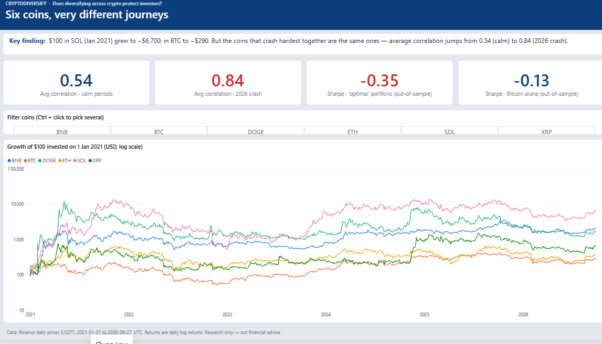
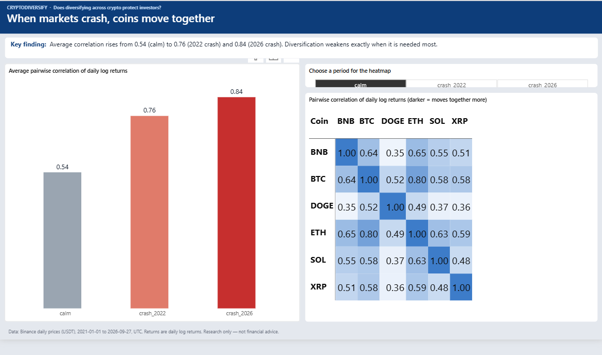
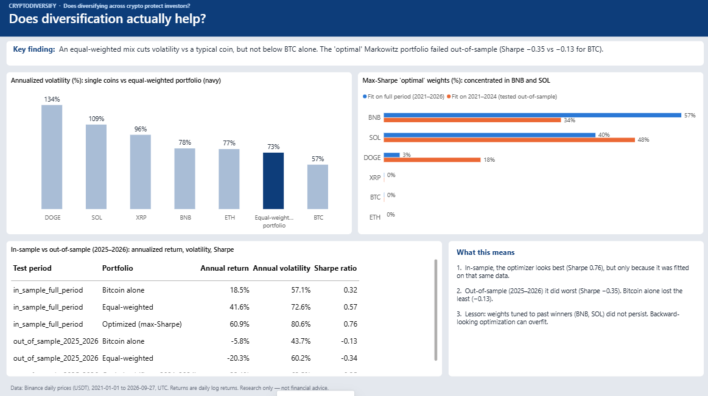

# CryptoDiversify: Does Diversifying Across Cryptocurrencies Actually Protect Investors?

A statistical study of six major cryptocurrencies (2021–2026). It tests whether holding
several coins really reduces risk, or whether they all crash together exactly when
protection is needed most.

**Tools:** Python (pandas, NumPy, SciPy) · SQL (SQLite) · Power BI · Git
**Methods:** correlation regimes, moving-block bootstrap confidence intervals, portfolio volatility, Markowitz mean-variance optimization, in-sample vs out-of-sample evaluation



---

## Key findings

| # | Question | Result | Verdict |
|---|---|---|---|
| RQ1 | Are coins more correlated during crashes? | Average pairwise correlation **0.54 in calm periods vs 0.76 (2022 crash) and 0.84 (2026 crash)**. Difference +0.22 (95% CI 0.09 to 0.33) and +0.30 (95% CI 0.17 to 0.40), p < 0.001 | **H0 rejected.** Diversification weakens in crashes. |
| RQ2 | Does an equal-weighted portfolio lower volatility? | 72.6% annualized vs 91.8% for the average single coin: **−19.2 points (95% CI −25.7 to −12.6)**. But it is **+15.5 points above Bitcoin alone** (95% CI 10.8 to 20.8). | **Partly.** Lower than a typical coin, not lower than BTC. |
| RQ3 | Does Markowitz optimization beat equal-weighting? | In-sample Sharpe 0.76 vs 0.57 looks better. **Out-of-sample (2025–2026): −0.35 vs −0.34 (EW) and −0.13 (BTC)**. Optimized minus EW = −0.01 (95% CI −0.30 to 0.27). | **H0 not rejected.** No evidence optimization helps. Its in-sample edge vanished. |

**In one sentence:** crypto diversification gives some everyday risk reduction, but
correlations jump during crashes, and "optimal" weights fitted on past data did not
beat simple equal-weighting on new data.

---

## Data

- **Source:** Binance public API, daily close prices ("klines") in USDT. Free, no API key needed.
- **Coins:** BTC, ETH, SOL, BNB, XRP, DOGE.
- **Period:** 2021-01-01 to 2026-09-27 (UTC). That is 2,096 days per coin with no gaps (checked in `sql/01_data_coverage.sql`).
- **Returns:** daily log returns, `ln(P_t / P_{t-1})`.
- **Crash windows** were defined *in advance* from real events, not picked after seeing results:
  - 2022-05-01 to 2022-12-31: Terra/Luna and FTX collapses
  - 2026-01-01 to 2026-06-30: war and Fed-driven decline
  - All other days count as "calm".

## Methods

1. **Correlation regimes (RQ1).** Pearson correlation of log returns, not prices, to avoid
   spurious correlation from shared trends. We compare the average of the 15 pairwise
   correlations across periods.
2. **Portfolio volatility (RQ2).** Annualized standard deviation (×√365, because crypto
   trades every day) of an equal-weighted daily-rebalanced portfolio, compared with each coin.
3. **Markowitz optimization (RQ3).** Long-only max-Sharpe weights (SciPy SLSQP, risk-free
   rate 0%). The model is fitted on **2021–2024** and evaluated on **2025–2026**, which the
   optimizer never saw. This avoids look-ahead bias.
4. **Uncertainty.** A moving-block bootstrap (20-day blocks, 2,000 resamples) gives 95%
   confidence intervals and one-sided p-values. Blocks keep the volatility clustering of
   daily returns, which a plain bootstrap would destroy.

## Dashboard (Power BI)

| Crash correlation | Portfolio results |
|---|---|
|  |  |

File: `dashboard/cryptodiversify.pbix`. It has 3 pages: overview with KPI cards, crash
correlation heatmap with a period selector, and portfolio results.

## Limitations

- **Six coins only**, all still large today. This introduces survivorship bias: coins that
  died since 2021 are not included.
- Crash windows involve judgment about exact boundary dates. They are not detected statistically.
- The out-of-sample test is only ~21 months long, so Sharpe ratio differences have wide
  confidence intervals.
- No transaction costs, slippage, or rebalancing costs. Risk-free rate is assumed to be 0%.
- Correlation does not imply causation, and the past does not guarantee future crashes behave the same way.
- **Research for learning purposes. Not financial advice.**

## Project structure

```
├── main.py                  # runs the whole pipeline end to end
├── src/
│   ├── fetch_data.py        # download daily prices from Binance
│   ├── load_to_db.py        # build the SQLite database (prices, returns)
│   ├── analysis.py          # RQ1–RQ3 estimates + tables for Power BI
│   └── significance.py      # block-bootstrap CIs and tests
├── sql/                     # 8 commented SQL queries (aggregates, JOIN, CASE, window function)
├── notebooks/               # 01_eda.ipynb (exploration), 02_analysis.ipynb (analysis + charts)
├── data/processed/          # result tables used by the dashboard
├── dashboard/               # Power BI file + screenshots
├── reports/final_report.md  # full written report
└── PROJECT_BRIEF.md         # research questions and hypotheses, written before the analysis
```

## How to run

```bash
python -m venv .venv
.venv\Scripts\activate          # Windows
pip install -r requirements.txt
python main.py                  # downloads data, builds the DB, runs analysis + bootstrap
```

Then open `dashboard/cryptodiversify.pbix` in Power BI Desktop and click **Refresh**. If the
project is in a different folder, first update the CSV paths under
*Transform data → Data source settings*.
Re-downloading pulls prices up to today, so numbers may differ slightly from those above.

---

*Author: Aswani A. MSc Statistics (University of Kerala).*
